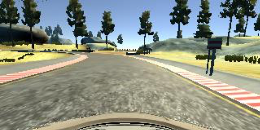
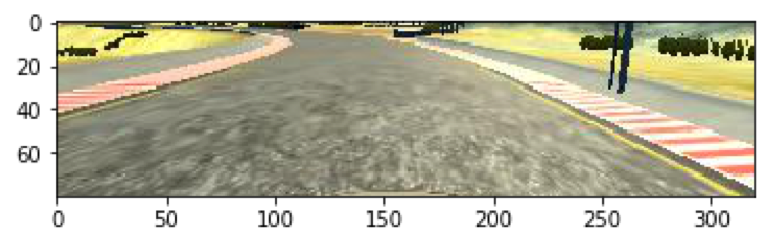
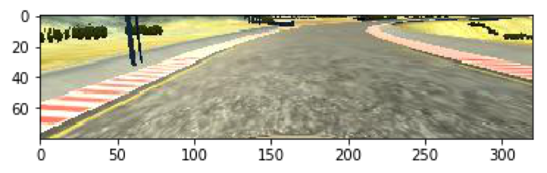
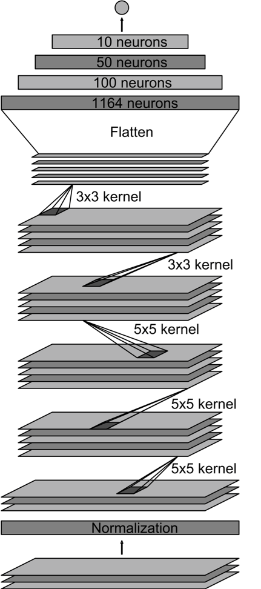

### Omar benzakour
---

# **Behavioral clonning** 

##Overview

In this project, we will teach a car how to drive. The goal is to make a car complete a lap staying at the centre of the road. To achieve this, we will build a neural network that will process images and output the steering angle of the wheel.
The NN will adapt the steering angle based on the borders of the road. These borders have different nature (red and while lines, mud, bridge, …) we can either feed the NN different images of the borders or process the images to output a uniform border (like what we did in the first project of this term). We will go for the first solution in this project, if it doesn’t work we might switch to the second solution.
Another remark concerns the racetrack, almost all the turns are toward the left, therefore we will mirror all the images and adjust the steering angle accordingly to teach the car to turn right.
Another remark concerns the speed; indeed, the steering depends of the speed at which the car goes. Since we don’t use the speed parameter in this project we will keep the same speed while generating the data.

## Datasets

### Training
The training data contains two laps of me driving the car. I have used the mouse to have a regular steering angle, indeed when we have too high variations of the steering angle if we use the keyboard. Moreover, I have taken some small videos of me pulling the car from the border of the road back to the centre. Indeed, we also have to teach the car to get back on track.

### validation
The validation dataset of the network consists of me driving again the circuit (this dataset is not contained in the training dataset).

### Test
The test dataset consists of seeing the performance on the circuit.

## Pre-processing

It consists of cropping the top (sky, trees, …) and down (front of the car) of the image.
We normalize then the image subtracting, for all the channels, 128 to the pixel value and dividing the result by 128. The pixel value will then range between -1 and 1 and have a 0-mean value. This operation makes the training of the NN more performant. Let us see an example of the pre-processing pipeline:

### Original image

	
	<figcaption>Original image</figcaption>

### cropped image

	
	<figcaption>Cropped</figcaption>

### augmented image

	
	<figcaption>mirrored image</figcaption>

Remark there is no need to turn the image if the car goes straight, however when I have drove the car I have always steered the wheel so I have mirrored all the images and multiplied the steering angle by (-1)

## Neural network architecture

	
	<figcaption>neural network model</figcaption>

The NN follows the architecture of the Nvidia Neural Network (the research paper can be found in this repo, in the research paper folder) which consists of 9 layers, including a normalization layer, 5 convolutional layers, and 3 fully connected layers. All these layers except the last one use the relu activation function to introduce non-linearity. 
Moreover, we added a dropout layer with a rate equal to 0.8 after the flatten layer.The first 3 convolution layers use a 2x2 stride for a 5x5 kernel.  We then use a 3x3 Kernel with no stride (1x1). We will now give describe the dimension of each layer

Input: (80, 320, 3)

**First Convolutional layer followed by relu:**  
Patch: 5x5x3 with a depth of 24  
Stride: 2x2 using valid padding  
Output: (38,158,24)

**Second Convolutional layer followed by relu:**  
Patch: 5x5x24 with depth of 36  
Stride: 2x2 using valid padding  
Shape: (17, 77, 36)

**Third convolutional layer followed by relu**:  
Patch: 5x5x36 with depth of 48  
Stride: 2x2 using valid padding  
Shape: (7, 37, 48) 

**Fourth convolutional layer followed by relu**: 
Patch: 3x3x48 with depth of 64 
Stride: 1x1 using valid padding 
Shape: (5, 35, 64)

**Fifth convolutional layer followed by relu**: 
Patch: 3x3x64 with depth of 64 
Stride: 1x1 
Shape: (3, 33, 64)

**Flattening layer followed by relu**: 
Shape: (6336,1) 

**Fully connected layer followed by relu**: 
output: 100

**Fully connected layer followed by relu**: 
output: 50

**Fully connected layer**: 
output: 1

**Number of trainable parameters**: 770619

## Training

In order to train this NN we will use an Adam Optmisier with a learning rate of 0,001. We run the training algorithm for 5 epochs.

The result of this NN were pretty impressive after only the first try. Indeed, without any tuning, the car manages to go at the end of the bridge. It then crashes. Indeed I have noticed that my car didn’t learn to make strong angles to get back on track. I therefore added more picture of me pulling back the car on track with a **real STRONG steering angle**. The **"get back on track"** data was added for all type of border (dusty one, red/white lane one / yellow one). My car was then able to finish the whole lap without problem. 

## Conclusion

In this project, We borrowed a NN architecture and tuned the training data to improve the results. We were able to do that because the training dataset wasn’t huge. Indeed, we started with a small training dataset to see where it could take us. Then, we added enough data so it could generalise better. Following this approach allowed us to keep a small and short feedback loop. We can see the result in the **result_video.mp4** clip that can be found at the root of the directory

